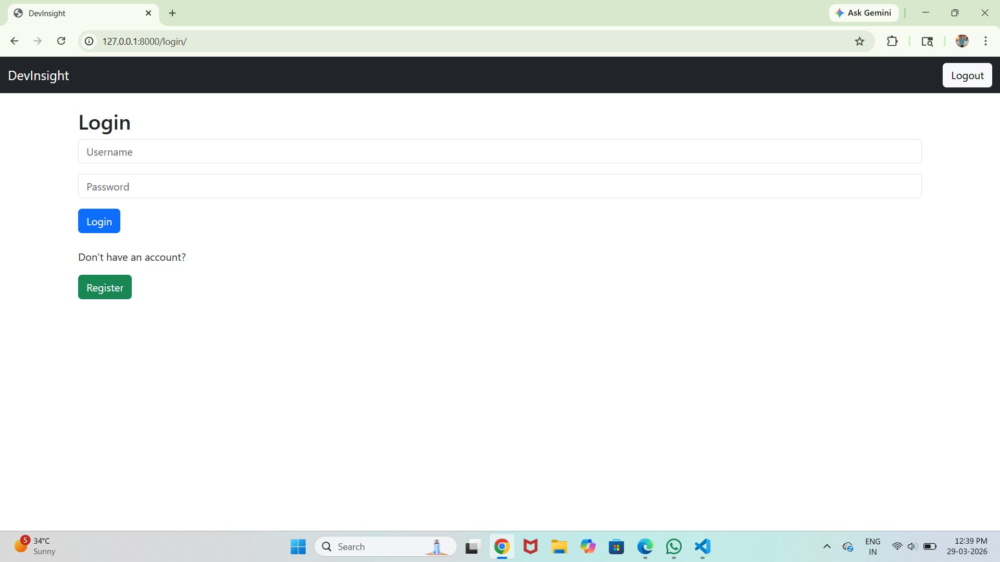
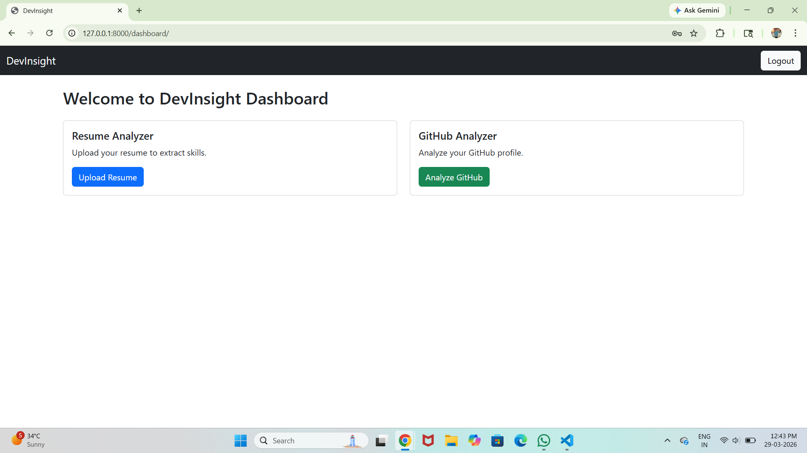

# 🚀 DevInsight – AI Resume & GitHub Analyzer

## 📌 Overview
DevInsight is a Django-based web application that analyzes resumes and GitHub profiles to provide developer insights.

## 🔥 Features
- Resume Upload & Skill Extraction
- Resume Score (ATS-like)
- Skill Gap Detection
- GitHub Profile Analyzer
- Profile Strength Rating
- User Authentication

## 🛠 Tech Stack
- Python
- Django
- HTML, CSS, Bootstrap
- GitHub API
- pdfplumber

## ⚙️ How It Works
1. Upload resume → Extract skills
2. Calculate score & missing skills
3. Enter GitHub username → Analyze profile

## 📸 Screenshots

### 🔐 Login Page

### 📊 Dashboard

### 📄 Resume Upload

### 📈 Resume Analysis Result

### 🧠 GitHub Username Input

### ⭐ GitHub Analysis Result

## 🙌 Author
Chetla Abhilash
